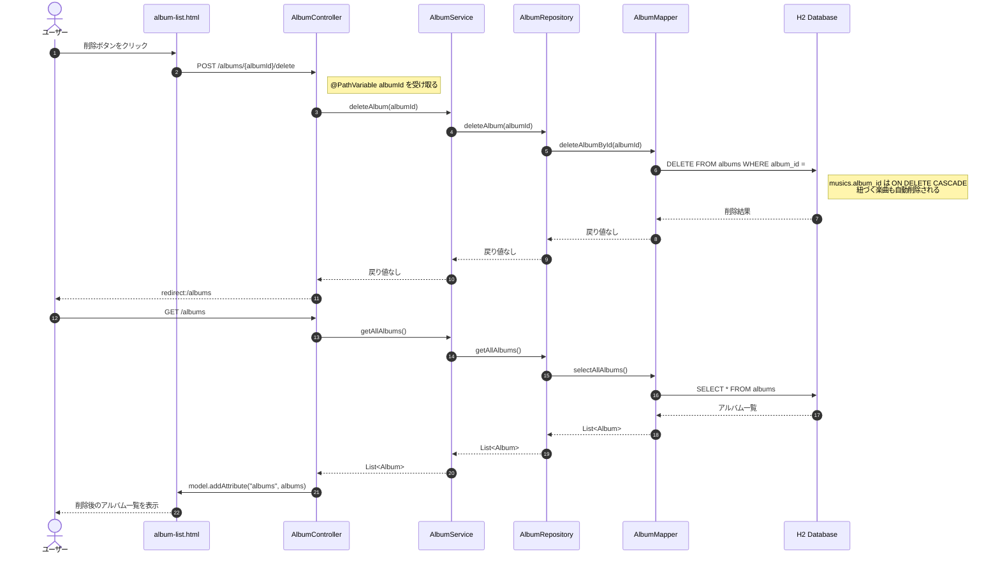

# Album Delete Sequence

```mermaid
sequenceDiagram
    autonumber
    actor User as ユーザー
    participant View as album-list.html
    participant Controller as AlbumController
    participant Service as AlbumService
    participant Repository as AlbumRepository
    participant Mapper as AlbumMapper
    participant DB as H2 Database

    User->>View: 削除ボタンをクリック
    View->>Controller: POST /albums/{albumId}/delete
    Note right of Controller: @PathVariable albumId を受け取る

    Controller->>Service: deleteAlbum(albumId)
    Service->>Repository: deleteAlbum(albumId)
    Repository->>Mapper: deleteAlbumById(albumId)
    Mapper->>DB: DELETE FROM albums WHERE album_id = #{albumId}

    Note right of DB: musics.album_id は ON DELETE CASCADE<br/>紐づく楽曲も自動削除される
    DB-->>Mapper: 削除結果
    Mapper-->>Repository: 戻り値なし
    Repository-->>Service: 戻り値なし
    Service-->>Controller: 戻り値なし

    Controller-->>User: redirect:/albums
    User->>Controller: GET /albums
    Controller->>Service: getAllAlbums()
    Service->>Repository: getAllAlbums()
    Repository->>Mapper: selectAllAlbums()
    Mapper->>DB: SELECT * FROM albums
    DB-->>Mapper: アルバム一覧
    Mapper-->>Repository: List<Album>
    Repository-->>Service: List<Album>
    Service-->>Controller: List<Album>
    Controller->>View: model.addAttribute("albums", albums)
    View-->>User: 削除後のアルバム一覧を表示
```
